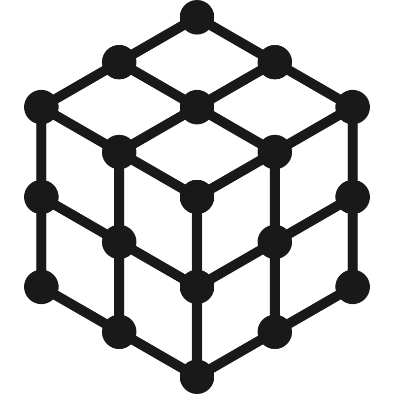
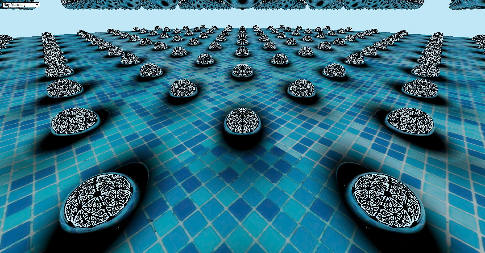
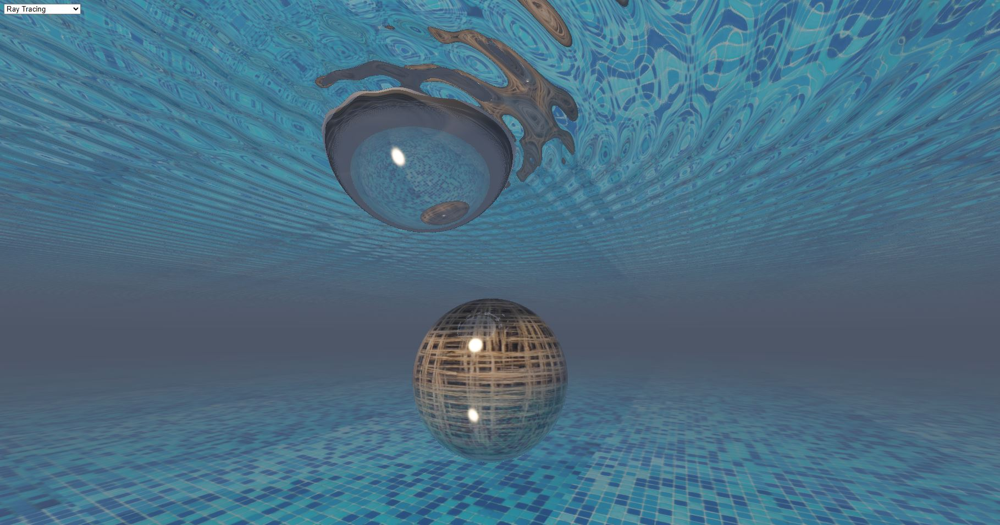
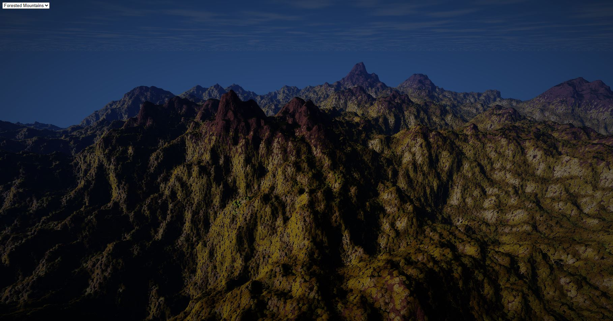

<h1>

3D Ray Marching & Ray Tracing
</h1>

## Overview

The 3D rendering techniques implemented in this app can be summarized as follows:
- Ray Marching (where shadow and ambient occlusion were used)
- Ray Tracing (where primary and secondary rays were used)
- Signed Distance Functions (of which the entire scene is created by the union operation)
- ShaderMaterial provided by [three.js](https://threejs.org/)
- Simplified PBR (Physically-Based Rendering)

The rendering parameters used for the simplified PBR can be listed as follows:
- Reflection and Transmission
- IOR (Index of Refraction)
- *Fresnel* Equation

## Preview
You can explore the three examples below [here](https://sangkunine.github.io/three-raymarch). 

## Contributions
All contributions are welcome as well as donations! Please contact us at **sangkunine@gmail.com** for any questions or suggestions. Thank you [jamhpark](https://github.com/jamhpark) and [ellyhpark](https://github.com/ellyhpark) for your contributions. The pool tile texture was designed by [Freepik](https://www.freepik.com).